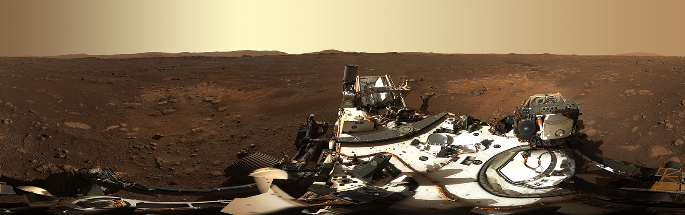

# Hi! 👋 I'm Deedat Billa, a fullstack javascript developer and a space enthusiast.
1. Co-founder & CTO of [Tranzo Technologies Africa LTD](https://tranzopay.com) 💻
2. Developer of [Serool](https://serool.com/). A complete platform for starting and operating a business in Ghana. Reliable, Efficient and Affordable.
3. Developer of [Clypsync](https://priceless-kilby-80e931.netlify.app/) & [Al-Masjid radio & tv](https://play.google.com/store/apps/details?id=com.foreverislamfoundation.app)
4. Ex full stack engineer @[Flightmaker Caasco](https://caasco.io)
5. Ex frontend engineer @[btlafrica](https://btlafrica.com)
6. Worked part time in buidling the frontend of [Digiclass](https://kelemm-digiclass.herokuapp.com/)
7. Ex Blockchain developer @tezosIsrael
8. Currently a Fullstack developer at SavannachTech
## ⚡ My most used technologies
1. React
2. React Native
3. Nodejs
4. Nextjs
5. Tailwind CSS
6. Graphql
7. Rest
8. AWS
9. Firebase
10. Mongodb
11. Express
12. Solidity
13. Web3js
14. Ligo
# NB: Most of my best projects are private repos. email me at deedat5@gmail.com so I dazzle you.

## ⚡ Github Stats

### Let's Connect 🔗

 

